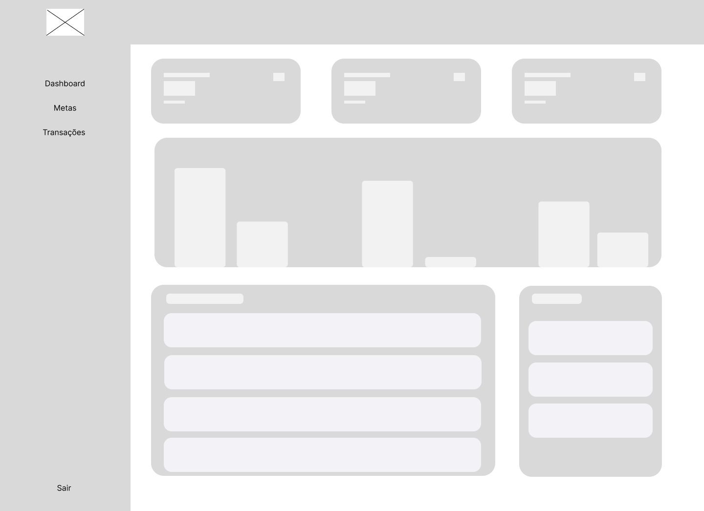
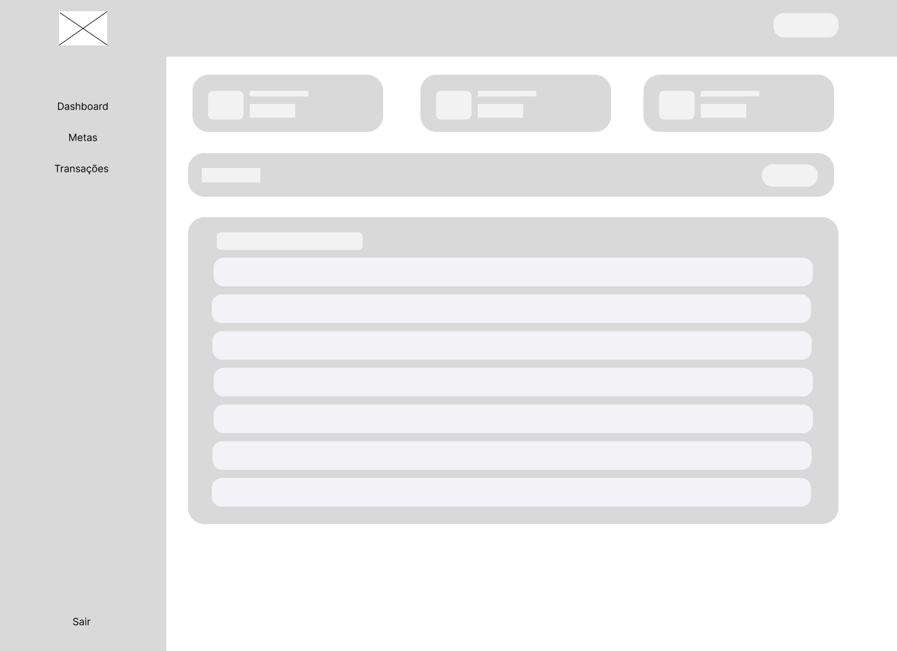
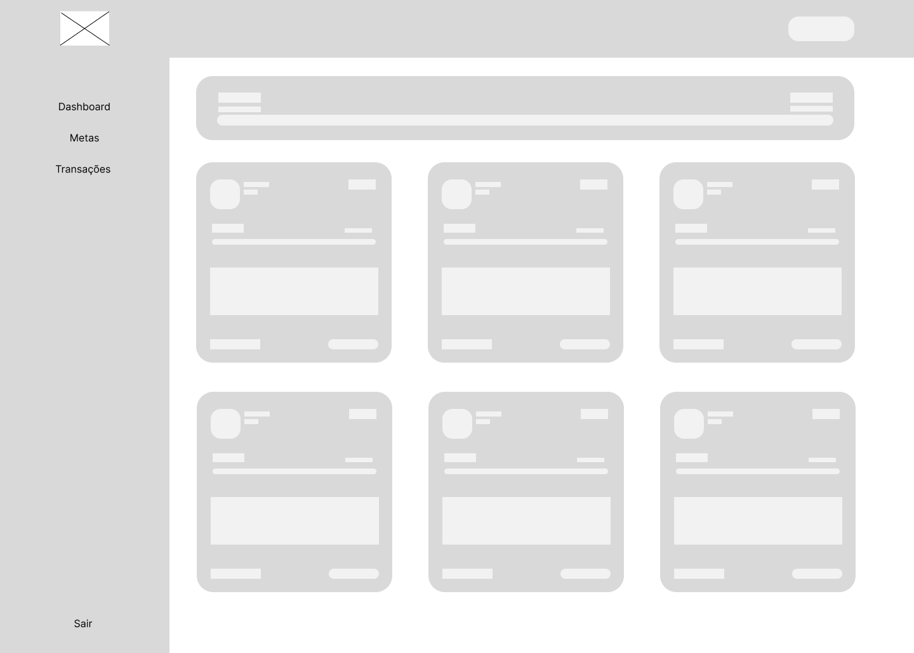
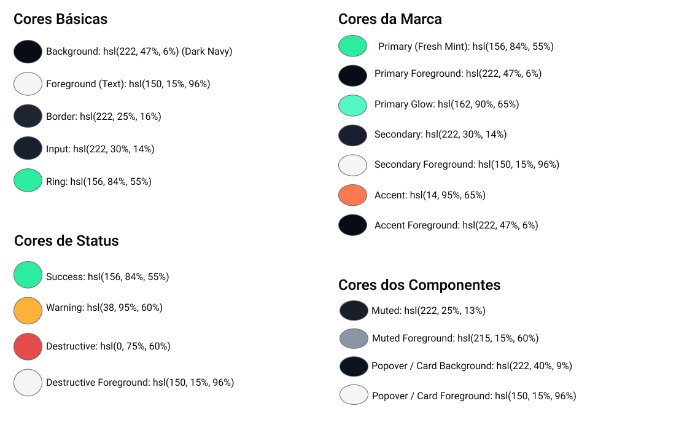
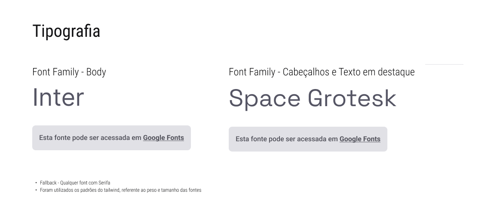
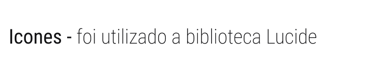

# 4. PROJETO DO DESIGN DE INTERAÇÃO

## 4.1 Personas
Persona - Julia Santos

Persona - Marina Oliveira

Persona - Gabriel Leal

Persona - Carla Mendes

Persona - Claudia Lopez

Persona - Francisco Souza

## 4.2 Mapa de Empatia
Mapa de Empatia - Julia Santos

Mapa de Empatia - Marina Oliveira

Mapa de Empatia - Gabriel Leal

Mapa de Empatia - Carla Mendes

Mapa de Empatia - Claudia Lopez

Mapa de Empatia - Francisco Souza

## 4.3 Protótipos das Interfaces
Os protótipos de alta fidelidade do sistema Midas Helper foram desenvolvidos buscando representar com fidelidade o design final da aplicação. Durante o desenvolvimento, foram considerados os princípios gestálticos, as recomendações ergonômicas e as 8 regras de ouro de Shneiderman, garantindo uma interface intuitiva, consistente e centrada no usuário. A seguir, são apresentadas as principais telas do sistema com a descrição das decisões de design adotadas.

#### 4.3.1 Protótipo - Tela Home

##### 4.3.1.1 Objetivo da Tela
A tela Home é a página inicial do sistema e tem como objetivo apresentar o Midas Helper ao usuário, comunicando o propósito da plataforma e incentivando o acesso por meio de uma chamada para ação. A tela também exibe as principais funcionalidades do sistema em formato de cards, permitindo que o visitante compreenda o valor da ferramenta antes de se cadastrar.

##### 4.3.1.2 Princípios Gestálticos
* Similaridade: Aplicado na seção de “Funcionalidades”, onde os seis cards possuem o mesmo tamanho, cor de fundo e estrutura interna como ícone, título e descrição;
* Proximidade: Os campos de “Entrar” e “Criar Conta” estão próximos um do outro, formando um grupo visual coerente de entrada de dados e reforçando a ideia de sequência de ação. Também aplicado na seção de “Funcionalidades”, no agrupamento dos cards em 3 colunas de 2;
* Simetria: Aplicado no alinhamento horizontal dos itens do menu de navegação (Funcionalidades, Como funciona, Assistente Inteligente);
Região Comum: Aplicado ao separar visualmente a seção principal com o título  da seção de cards por meio de cores de fundo distintas.

##### 4.3.1.3 Recomendações Ergonômicas
* Os ícones dos cards utilizam símbolos reconhecíveis e padronizados;
* Fontes simples, tamanho adequado, espaçamento generoso e contraste apropriado facilitam a leitura, além do contraste entre o texto claro e o fundo escuro;
* Linguagem direta e sem jargão técnico com portugues simples, sem a necessidade de conhecimento prévio do usuário para utilizar o aplicativo.

##### 4.3.1.4 Regras de Ouro (Shneiderman)
* Consistência: Mantido o mesmo cabeçalho com logo, menu de navegação e botões "Entrar" e "Criar conta" em destaque, estabelecendo um padrão visual que se repete em toda a aplicação;
* Reduzir a Carga de Memória: Apresentado as funcionalidades diretamente na tela por meio de cards com ícones e rótulos, sem exigir que o usuário explore o sistema para entender o que ele oferece;
* Feedback Informativo: Aplicada no botão "Começar agora", que sinaliza a ação disponível ao visitante.

#### 4.3.2 Protótipo - Tela Dashboard

##### 4.3.2.1 Objetivo da Tela
O Dashboard é a tela principal do sistema após o login. Seu objetivo é oferecer ao usuário uma visão consolidada de sua situação financeira, exibindo o saldo total, depósitos e gastos do mês, um gráfico da evolução financeira, as atividades recentes e um resumo das metas cadastradas.

##### 4.3.2.2 Princípios Gestálticos
* Similaridade: Aplicado nos três cards superiores (Saldo Total, Depósitos este mês e Gasto este mês), que compartilham o mesmo tamanho e estrutura, indicando que são métricas equivalentes;
* Proximidade: Aplicada na organização das informações em blocos temáticos sendo  os cards de resumo no topo, gráfico ao centro e as atividades recentes e metas na parte inferior;
* Região Comum: Aplicada  na delimitação de cada bloco de informação por meio de cards com um fundo levemente diferenciado, facilitando a leitura e a navegação visual;
* Boa Continuidade: Aplicado no menu lateral fixo, que organiza verticalmente as seções do sistema.

##### 4.3.2.3 Recomendações Ergonômicas
* O menu lateral exibe ícones acompanhados de rótulos textuais, seguindo o padrão de reconhecer em vez de recordar;
* O item ativo no menu é destacado visualmente em verde, indicando ao usuário sua localização atual no sistema;
* Os valores financeiros utilizam formatação monetária padrão (R$), facilitando a leitura imediata;
* O gráfico de barras representa visualmente a evolução financeira, reduzindo a carga cognitiva na interpretação dos dados.

##### 4.3.2.4 Regras de Ouro (Shneiderman)
* Consistência: Mantido o mesmo cabeçalho, menu lateral e paleta de cores presentes em todas as telas internas;
* Feedback Informativo: Aplicado na saudação personalizada pelo nome do usuário e os indicadores de variação percentual nos cards;
* Reduzir a Carga de Memória: Aplicado ao consolidar as informações mais relevantes em uma única tela, sem exigir que o usuário navegue por múltiplas seções para obter uma visão geral.

#### 4.3.3 Protótipo - Tela Metas

##### 4.3.3.1 Objetivo da Tela
A tela de Metas exibe as metas financeiras cadastradas pelo usuário, mostrando o progresso geral e individual de cada meta. O usuário pode visualizar o valor acumulado, o percentual atingido, o prazo e os insights gerados pela IA do sistema.

##### 4.3.3.2 Princípios Gestálticos
* Proximidade: Aplicado ao agrupar em um único card todas as informações de uma meta (ícone, título, valor, progresso, insight e prazo), indicando que pertencem ao mesmo contexto;
* Boa Continuidade: Aplicado na barra de progresso horizontal, que guia o olhar do usuário da esquerda (início) para a direita (conclusão), representando visualmente o avanço em direção à meta;
* Região Comum: Aplicado na delimitação do card de cada meta em relação ao restante da tela, facilitando a identificação de cada objetivo individualmente.

##### 4.3.3.3 Recomendações Ergonômicas
* O ícone associado à meta (ex: avião para viagem) segue o princípio da metáfora, facilitando o reconhecimento imediato do objetivo;
* A barra de progresso utiliza cores contrastantes (laranja sobre fundo escuro) para indicar o percentual concluído de forma visual e intuitiva;
* O percentual de progresso é exibido também numericamente, combinando representação gráfica e textual;
* O botão "Ajustar Meta" está posicionado próximo às informações da meta, facilitando o acesso à edição sem navegação adicional.

##### 4.3.3.4 Regras de Ouro (Shneiderman)
* Feedback Informativo: Aplicada com o percentual de progresso exibido tanto numericamente (28%) quanto graficamente na barra de progresso. Aplicado também no insight da IA onde cumpre a função de orientar o usuário sobre os próximos passos;
* Controle do Usuário: Aplicado pelo botão "Ajustar Meta", que permite ao usuário modificar sua meta a qualquer momento.

#### 4.3.4 Protótipo - Tela Transações

##### 4.3.4.1 Objetivo da Tela
A tela de Transações exibe o histórico de movimentações financeiras do usuário, com informações de descrição, categoria, método de pagamento, data, status e valor. Também apresenta um resumo dos depósitos totais, gastos totais e valor disponível, além de opção de filtragem.

##### 4.3.4.2 Princípios Gestálticos
* Similaridade: Aplicado na tabela de transações, onde cada linha segue a mesma estrutura de colunas, indicando que são itens equivalentes;
* Proximidade: Aplicado ao agrupar as três métricas resumidas (Depósitos Totais, Gastos Totais e Valor Disponível) no topo da tela, comunicando que são dados do mesmo contexto financeiro;
* Região Comum: Aplicado ao delimitar a área da tabela em relação ao restante da tela, facilitando a leitura do histórico.

##### 4.3.4.3 Recomendações Ergonômicas
* Os badges de status ("Débito" em vermelho e "Crédito" em verde) seguem a convenção de cores amplamente reconhecida para entradas e saídas financeiras;
* Os valores negativos são exibidos em vermelho e os positivos em verde, reforçando a distinção sem depender apenas do sinal numérico;
* A tabela possui cabeçalhos de coluna claros (Descrição, Categoria, Método, Data, Status, Valor), seguindo o padrão de reconhecer em vez de recordar;
* As colunas são ordenadas de forma lógica, facilitando a leitura sequencial das informações de cada transação.

##### 4.3.4.4 Regras de Ouro (Shneiderman)
* Consistência: Mantida com o mesmo menu lateral, cabeçalho e paleta de cores das demais telas internas;
* Fornecer Atalhos: Aplicada com o botão "Adicionar Transação" em destaque no canto superior direito, permitindo acesso rápido à ação mais frequente;
* Feedback Informativo: Aplicado nos cards de resumo que atualizam automaticamente os totais conforme as transações são registradas.

#### 4.3.5 Protótipos - Telas Adicionar Meta / Adicionar Transação

##### 4.3.5.1 Objetivo das Telas
As telas correspondem aos modais de cadastro de nova meta financeira e de nova transação. Ambas compartilham a mesma estrutura de formulário em modal, onde o usuário preenche os dados necessários e confirma ou cancela a ação. No modal de meta, são preenchidos título, valor alvo, data alvo e ícone e no modal de transação, são preenchidos descrição, valor, data, categoria, status e método de pagamento.

##### 4.3.5.2 Princípios Gestálticos
* Região Comum: Aplicado na delimitação da área de interação por meio de um card sobreposto ao conteúdo da tela anterior, concentrando o foco do usuário no formulário;
* Proximidade: Aplicado ao agrupar os campos relacionados na mesma linha, Valor e Data, aparecem lado a lado em ambos os modais, indicando que são informações complementares;
* Boa Continuidade: Aplicado ao conduzir o preenchimento de forma sequencial de cima para baixo, seguindo a ordem lógica de cada formulário.

##### 4.3.5.3 Recomendações Ergonômicas
* Os campos de texto possuem placeholders com exemplos ("Ex: Viagem para Europa" e "Ex: Compra no supermercado"), auxiliando o usuário no entendimento do formato esperado;
* Os campos de seleção (Categoria, Status, Método de Pagamento e Ícone) utilizam dropdowns com itens ordenados e mutuamente exclusivos;
* Os botões "Cancelar" e "Salvar" estão posicionados juntos no rodapé dos modais, seguindo a convenção esperada pelo usuário;
* A confirmação de salvamento é exibida via toast por 3 segundos, informando o resultado da ação de forma não intrusiva e sem exigir interação para fechar;
* Os campos obrigatórios são sinalizados com asterisco (*), diferenciando visualmente os campos obrigatórios dos opcionais e orientando o usuário sobre o que é necessário preencher.

##### 4.3.5.4 Regras de Ouro (Shneiderman)
* Reversão de Ações: Garantido em ambos os modais pelo botão "Cancelar" e pelo ícone X no canto superior direito, permitindo que o usuário abandone o formulário sem consequências;
* Marcar o Final dos Diálogos: Aplicado com o botão "Salvar", sinalizando o encerramento do fluxo de cadastro;
* Prevenção de Erros: Considerado com o uso de campos tipados (número para valor, data para o campo de data e dropdowns para seleções) e pela sinalização de asterisco (*) nos campos obrigatórios, reduzindo a possibilidade de entradas inválidas.

#### 4.3.6 Wireframes do projeto
Dashboard

Transações

Metas

#### 4.3.7 Guias de estilo do projeto
Cores\

Tipografia\

Icones\

## 4.4 Testes com Protótipos
Nesta seção você deve apresentar os testes realizados com usuários utilizando os protótipos de alta fidelidade desenvolvidos na seção anterior. O objetivo é avaliar a usabilidade, a clareza das informações e a adequação do design às necessidades das personas definidas no projeto.

Cada integrante do grupo deverá aplicar o teste com um usuário distinto, preferencialmente alinhado ao perfil das personas criadas. Devem ser definidas previamente as tarefas que o usuário deverá executar no protótipo (por exemplo: realizar um cadastro, buscar um produto, concluir uma compra).

Durante a aplicação do teste, registre observações sobre comportamentos, dúvidas, erros e comentários feitos pelo usuário, bem como o tempo necessário para a execução de cada tarefa. Ao final, colete o feedback do participante, destacando pontos positivos e aspectos a serem melhorados.

Os resultados obtidos por todos os integrantes devem ser consolidados, apresentando uma análise geral com os principais problemas encontrados, oportunidades de melhoria e as ações previstas para o projeto final. 
